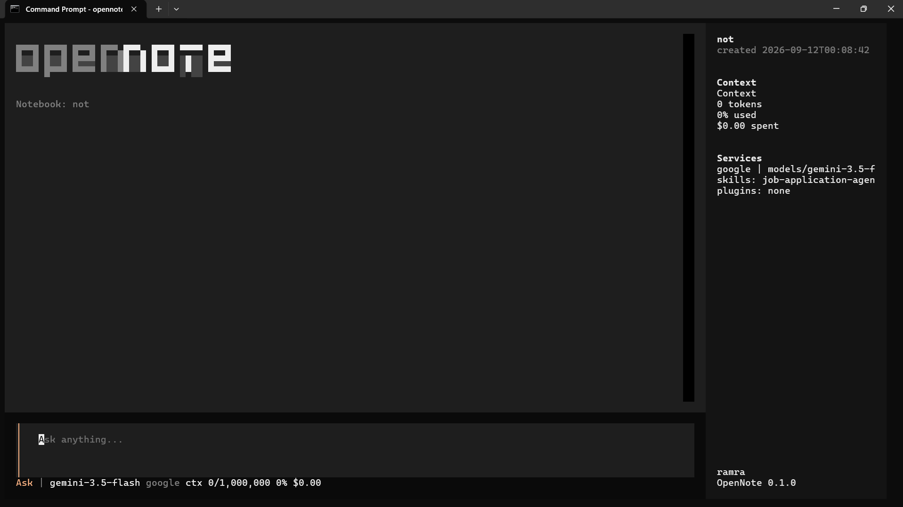

<div align="center">

  <h1 align="center">OpenNote</h1>

  <p align="center">
    An open source, privacy-focused agentic harness to help you study
     <br />
     Follow <a href="https://x.com/zirmythen">@zirmythen on X</a> for updates
    <br />
    <a href="docs/0-START-HERE/index.md">📚 Get Started</a>
    ·
    <a href="docs/3-USER-GUIDE/index.md">📖 User Guide</a>
    ·
    <a href="docs/2-CORE-CONCEPTS/index.md">✨ Features</a>
    ·
    <a href="docs/1-INSTALLATION/index.md">🚀 Deploy</a>
  </p>
</div>

---

## ⚡ Quick start

```bash
pip install -e ".[dev]"

opennote create my_notebook
opennote ingest paper.pdf --notebook my_notebook
opennote ask "What does the paper claim about retrieval?" --notebook my_notebook
opennote chat --notebook my_notebook
```

---
## A private, multi-model, 100% local, full-featured alternative to NotebookLM 



In a world dominated by Artificial Intelligence, having the ability to think and acquire new knowledge , is a skill that should not be a privilege for a few, nor restricted to a single provider.

**OpenNote empowers you to:**
- **Control your data** - Keep your research private and secure
- **Choose your AI models** - Support for 5+ providers including OpenAI, Anthropic, Ollama, LM Studio, and more
- **Organize multi-modal content** - PDFs, videos, audio, web pages, and more
- **Search intelligently** - Full-text and vector search across all your content
- **Chat with context** - AI conversations powered by your research
---


## 📦 Features

| Category | What you get |
|----------|-------------|
| **Ingestion** | PDF (Docling + fallback), DOCX, HTML/URL, TXT/MD — with heading/paragraph locators and section-heading citations |
| **Retrieval** | Vector search (SentenceTransformer + ChromaDB) + BM25 hybrid; always available, no API key required |
| **BYOK Chat** | Anthropic, OpenAI, OpenCode, Cerebras, Groq, Google — keys in OS keychain or env; live model validation via `GET /models` |
| **Grounded Q&A** | Single-turn `ask` with citation validation; multi-turn `chat` where the model decides when to search |
| **Studio generators** | Mind‑map, study guide, FAQ, briefing, timeline, suggested questions — with audio and narrated video output |
| **TTS chain** | groq → openai → gemini → edge-tts; graceful degradation to markdown transcript |
| **Narrated video** | Per‑slide Pillow images + TTS mp3 + ffmpeg mux to MP4; degrades to script + slides if any stage fails |
| **Textual TUI** | Tab cycles `ask → search → studio`; `/studio` submenu; slash commands `/mindmap /study /faq /briefing /timeline /suggest /audio /video /open /theme /help` |

---

## 🛠 Installation

**One-line (global):**

```bash
# macOS / Linux / Git Bash / WSL
curl -fsSL https://ramratan.in/install | bash

# Windows PowerShell 5.1 — bare `curl` is an alias for Invoke-WebRequest, use:
curl.exe -fsSL https://ramratan.in/install | bash
# or native PowerShell:
iwr -useb https://ramratan.in/install.ps1 | iex
```

**From source (dev):**

```bash
pip install -e ".[dev]"
```

*Note:* if you already have an `opennote` npm package installed globally, it shadows the CLI on PATH. Uninstall it (`npm uninstall -g opennote`) or use `py -m opennote.cli <cmd>` as an unambiguous fallback.

---

## 🧭 Usage

### Notebook management

```bash
opennote create <name> [--model BAAI/bge-small-en-v1.5]
opennote list
opennote rename <old> <new>
opennote delete <name>
```

### Ingest sources

```bash
opennote ingest [path-or-url] --notebook <name> [--parser auto|docling|fallback] [--ocr] [--force]
```

### Vector search (LLM‑free, cited)

```bash
opennote search "<query>" --notebook <name> --top-k 3 [--source file.pdf]
```

### BYOK keys

```bash
opennote auth add anthropic        # prompts for key, validates live, auto-picks a model
opennote auth list                 # providers, key source (keychain/env), selected models
opennote auth models openai        # live chat models; --set <id> to change default
opennote auth verify               # re-validate stored keys
opennote auth remove groq
```

### Local GGUF (offline, no API key)

```bash
# 1. Install optional local backend (llama-cpp-python; CPU wheels for 3.10-3.12, 3.13 needs newer wheel)
py -m pip install -e ".[local]"          # or: pip install llama-cpp-python

# 2. Register a model file (GGUF)
opennote local add D:\models\qwen2.5-7b-q4.gguf my-qwen --n-ctx 4096
opennote local list                       # shows registered models, * = active
opennote local use my-qwen                # set active

# 3. Chat via local model (no network)
opennote chat --provider local            # or: opennote ask "..." --provider local
# TUI: /model local  or palette → Switch Provider → local

# How it works
# - opennote/chat/local.py:LocalLlamaClient implements LLMClient via llama_cpp.Llama
# - Module cache _llama_cache keyed by (path, n_ctx, threads) → one load per process
# - History trimmed via trim_messages to n_ctx*3 chars; tool calls use JSON {"tool":..}
# - Env: LLAMA_N_GPU_LAYERS (0), LLAMA_CHAT_FORMAT (default) tune GPU/offload
```

Keys stored in the OS keychain when available, else read from `ANTHROPIC_API_KEY`, `OPENAI_API_KEY`, `OPENCODE_API_KEY`, `CEREBRAS_API_KEY`, `GROQ_API_KEY`, `GEMINI_API_KEY`. Validation requires network; `--no-verify` stores without checking.

### Grounded Q&A

```bash
# Single‑turn: retrieve → ground → complete → validate citations
opennote ask "What does the paper claim about retrieval?" --notebook <name> [--provider groq] [--top-k 5]

# Agent chat: model decides when to search, may search several times, answers with citations
opennote chat --notebook <name> [--new | --resume <id>] [--provider <id>]
```

### TUI (terminal UI)

Run bare `opennote` to launch the terminal UI. Tab cycles `ask → search → studio`; `/studio` opens the generator submenu. Slash commands: `/mindmap /study /faq /briefing /timeline /suggest /audio /video /open /theme /help`.

---

## 🧩 Capabilities (runtime‑probed, advertised to the model)

- **Tavily web search** requires `TAVILY_API_KEY`; otherwise degrades gracefully
- **TTS** resolves groq → openai → gemini → edge-tts; falls back to markdown transcript
- **Video** requires TTS + ffmpeg on PATH; each stage degrades independently
- **Retrieval** is always available (local embeddings + ChromaDB)

---
---

## 🛤 Roadmap (future)

- Images (OCR) support
- Non‑terminal UI surfaces
- More parser backends
- Plugin‑based studio generators

---

## 📄 License

MIT — see `LICENSE` for details.
